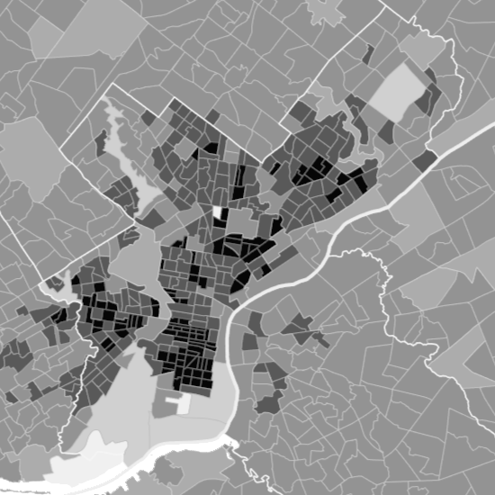

# LiquidMaps

## Summary

LiquidMaps is a Java application designed to create an artistic animated image of a city's roads. This is done by defining up to a thousand trips that are all pictorially represented at once.


## Instructions

The main() method of the program is contained in the MapBuilder class. To run the program, run that class.

Optionally, the included file "settings.json" can be modified to change various aspects of the program, including input data and the appearance of the output animation. The fields of this file are explained in the Settings section of this readme. After the fields are modified, LiquidMaps should be run again in order to produce new output with the changed settings.

## Technique

### Geographic DataSources

The tool to generate routes is based on the fabulous project [GraphHopper](https://github.com/graphhopper/graphhopper). In order to operate, GraphHopper requires a map file such as the included "philadelphia.osm.pbf". On the first run, this file will generate derived networks that can be used to rapidly find routes. The map file is specified with `cityMapFile`.

Trips have a beginning and an end. In order to efficiently specify the hundreds of trips, we need a way of describing hundreds of locations. We do this using `DataSource`s. A `DataSource` can be either a `VectorDataSource` or a `RasterDataSource`. Each `DataSource` is given a name so that it can be easily addressed later. One may specify many `DataSource`s, but ultimately, only two will be used. There are two variations on `DataSource`.

#### Raster Data
A `RasterDataSource` is a grayscale image of the region where the color denotes some quantity of interest. For instance, one could use this to denote population density or median household income. In order to give such an image meaning, one needs to specify two pixels of known location to orient the image on the globe. It is preferable that these two pixels are diagonal from each other. 

`RasterDataSource` assumes that the user is providing a choropleth map: [Choropleth Map](https://en.wikipedia.org/wiki/Choropleth_map)

The weights for grayscale images are determined based on their red-channel RGB values (0-255), where darker pixels (smaller RGB value) are more likely to be chosen based on an exponential probability distribution. 

The equation used is: colorWeight = 1 / ((redValue + 1) ^ 1.1).

Values of 255, i.e. "White" in a grayscale image, are automatically assigned a weight equal of zero. If all pixels have a value of 255, then all pixels will be assigned a weight equal to one. This is so that bodies of water (or other areas where humans don't start trips) do not generate start points or end points of trips.

In the case of the above sample.gif, we used the grayscale image below:



#### Vector Data
A `VectorDataSource` is a list of latitudes and longitudes from which we draw a random sample. For instance, one could imagine a list of the locations of all fire emergencies in a city for a year or a list consisting of just one point (e.g., the location of your home). If probability weights (the likelihood of the point being chosen by the program) are provided then they will be used. If weights are not provided then each point will have a weight equal to one.

The file for `VectorDataSource` must be formatted as follows: 1). tab-delimited text file 2). no column headers 3). only two or three columns, where the first column is latitude, the second column is longitude, and the third column (optional) is probability weight.

### Route Specification
After all of the `DataSource`s have been specified, we must define the family of trips. This can be done with the following parameters:
* The name of the starting `DataSource`
* The name of the ending `DataSource`
* The number of trips to be visualized
* The minimum time allowed for a trip
* The maximum time allowed for a trip
* A start time variance (seconds)
* A speed variance

The process goes as follows:
1. A random location is generated from the starting `DataSource`
2. A random location is generated from the ending `DataSource`
3. A route is found between these two points.
4. If the transit time required to complete that route is outside the minimum and maximum specified time, the route is discarded; otherwise, it is kept.
5. The trip's velocity is globally altered according to the `speedVariance`. For instance, a value of 0.30 will yield a new trip that will occur randomly between 85% to 115% of the original time.
6. The trip's start time is offset by a random time between 0 and the timeStartVariance.
7. The trip is added to the list to be visualized.

### Visualization
In order to animate the list of trips, all trip information must first be converted from world space (i.e., latitude and longitude in degrees) to screen space (i.e., x and y in pixels). This is accomplished using the `Converter`. The classes `PointWorld` and `PointScreen` both inherit from the abstract superclass `Point`, and the `Converter` can turn `PointWorld` objects to `PointScreen` objects. The converted trips have all of the same features and behavior as the original trips, except they are expressed in pixels rather than degrees.

The converted trips are passed to the `Animator`, which generates HTML, CSS, and JS code that draws each trip as a path and animates it according to user-specified settings. The JavaScript class [Segment](https://github.com/lmgonzalves/segment) is used to draw sections of each path using percentages (e.g., draw the segment between 45% and 55%), and durations and delays are calculated appropriately to ensure that each leg of each trip is animated at the correct speed. The code is written to an .html file.

## Settings

The input and output of LiquidMaps can be adjusted by modifying the fields of the settings file (settings.json). A description of each field is provided below.

### rasterDataDescs

This section contains reference data that is used to align a world-space map (i.e., latitude and longitude in degrees) and a screen-space map (i.e., x and y in pixels). Two known points (ideally diagonal from each other) must be identified on both the world-space map and the screen-space map in order for alignment to be possible.

For example, say that two prominent intersections are easily identifiable on a map with color-coded population density. The map is an image file. An image editor such as Microsoft Paint or GIMP could be used to get the pixel coordinates at those intersections. Meanwhile, the latitudes and longitudes of those intersections could be identified with Google Maps or a similar service.

Once these two forms of positional data are provided in settings.json (as `point1`, `point2`, `pixel1`, and `pixel2`), LiquidMaps will align the two maps, and then it will be able to work with them both.

`name`: A shorthand name for the image file containing weight data, which will be used to reference the file.<br />
`mapFileName`: The name of the image file containing weight data (e.g., a map with color-coded population density).<br />
`point1`<br />
	`lat`: The latitude of the first reference point in world space. Must correspond to the x-value of `pixel1`.<br />
	`lon`: The longitude of the first reference point in world space. Must correspond to the y-value of `pixel1`.<br />
`point2`<br />
	`lat`: The latitude of the second reference point in world space. Must correspond to the x-value of `pixel2`.<br />
	`lon`: The longitude of the second reference point in world space. Must correspond to the y-value of `pixel2`.<br />
`pixel1`<br />
	`pixelX`: The x-value of the first reference point in screen space. Must correspond to the latitude of `point1`. Must be an integer.<br />
	`pixelY`: The y-value of the first reference point in screen space. Must correspond to the longitude of `point1`. Must be an integer.<br />
`pixel2`<br />
	`pixelX`: The x-value of the second reference point in screen space. Must correspond to the latitude of `point2`. Must be an integer.<br />
	`pixelY`: The y-value of the second reference point in screen space. Must correspond to the longitude of `point2`. Must be an integer.<br />

### vectorDataDescs
`name`: A shorthand name for the vector file, which will be used to reference the file.<br />
`vecFileName`: The name of the vector file.<br />

### routingVars
`routeBeg`: The `name` (i.e., the shorthand name) of the image file containing weight data that should be used to select start points for trips.<br />
`routeEnd`: The `name` (i.e., the shorthand name) of the image file containing weight data that should be used to select end points for trips.<br />
`routeCount`: The number of trips that LiquidMaps should generate. Must be an integer.<br />
`routeMinTime`: The minimum allowed transit time for a trip.  Any found trip shorter than this will be excluded and not count toward `routeCount`.<br />
`routeMaxTime`: The maximum allowed transit time for a trip.  Any found trip longer than this will be excluded and not count toward `routeCount`.<br />
`timeStartVariance`: A random variate added to each trip to delay the start.  Units are in seconds.<br />
`speedVariance`: A random variate multiplied to each trip to change its speed.  For instance `speedVariance = 0.2` will result in a trip with a velocity between 90% and 110% of orginally calculated.<br />

### outputVars

This section contains reference data that is used to convert trips from world space to screen space to enable animation. It also contains a variety of settings for the appearance of the animation (e.g., color, line width).

To convert trips from world space to screen space, a bounding box is drawn using two points in world space (the desired upper-left and lower-right corners of the output map). It is scaled using a width value in pixels. For simplicity, `pointUpperLeft` and `pointLowerRight` can be the same as the two reference points (`point1` and `point2`) used in rasterDataDescs, if they are satisfactory as corners for the bounding box.

`pointUpperLeft` <br />
	`lat`: The latitude of the upper-left corner of the animation bounding box in world space.<br />
	`lon`: The longitude of the upper-left corner of the animation bounding box in world space.<br />
`pointLowerRight` <br />
	`lat`: The latitude of the lower-right corner of the animation bounding box in world space.<br />
	`lon`: The longitude of the lower-right of the animation bounding box in world space.<br />
`strFileName`: The desired name of the output file, without the extension. A ".html" extension will automatically be added.<br />
`strPageTitle`: The title of the output file (i.e., in the page's metadata).<br />
`strCanvasText`: Text that will appear on the canvas.<br />
`intCanvasWidth`: The width of the animation canvas in pixels.<br />
`strCanvasColor`: The color of the animation canvas expressed as a hex triplet: (e.g., "#000000").<br />
`intLineWidth`: The width of each line in pixels.<br />
`intLineLength`: The length of each line in pixels.<br />
`isKeepLinesVisible`: True if lines should remain on the canvas after they complete their animation.<br />
`strLineColorA`: The first color boundary of the lines expressed as a hex triplet (e.g., "#66DD22").<br />
`strLineColorB`: The second color boundary of the lines expressed as a hex triplet (e.g., "#FF88AA").<br />
`strTextColor`: The color of text on the canvas expressed as a hex triplet (e.g., "#FFFFFF").<br />
`dblTimeBetweenSpawns`: The amount of time (in seconds) to wait before spawning a new line.<br />
`dblMergeDistance`: The distance (in pixels) that defines whether two points are close enough together to be merged.

### Example Settings File

Below is the text of a correctly written settings file (settings.json). This can be used as a model when customizing the LiquidMaps settings.

```
{
	"cityMapFile": "philadelphia.osm.pbf",
	"rasterDataDescs": [
		{
			"name": "pop2012",
			"mapFileName": "PhillyPopDensity2012.png",
			"point1": {
				"lat": 40.138178,
				"lon": -75.308141
			},
			"point2": {
				"lat": 39.85096,
				"lon": -74.929113
			},
			"pixel1": {
				"pixelX": 0,
				"pixelY": 0
			},
			"pixel2": {
				"pixelX": 550,
				"pixelY": 550
			}
		}
	],
	"vectorDataDescs": [
		{
			"name": "home",
			"vecFileName": "VDSTest.txt"
		}
	],
	"routingVars": {
		"routeBeg": "pop2012",
		"routeEnd": "pop2012",
		"routeCount": 200,
		"routeMinTime": 5,
		"routeMaxTime": 10000,
		"timeStartVariance": 100,
		"speedVariance": 0.20
	},
	"outputVars": {
		"pointUpperLeft": {
			"lat": 40.138178,
			"lon": -75.308141
		},
		"pointLowerRight": {
			"lat": 39.85096,
			"lon": -74.929113
		},
		"strFileName": "animation",
		"strPageTitle": "LiquidMaps: Philadelphia",
		"strCanvasText": "",
		"intCanvasWidth": 600,
		"strCanvasColor": "#000000",
		"intLineWidth": 2,
		"intLineLength": 500,
		"isKeepLinesVisible": true,
		"strLineColorA": "#AAFF88",
		"strLineColorB": "#FFAA88",
		"strTextColor": "#FFFFFF",
		"dblTimeBetweenSpawns": 0,
		"dblMergeDistance": 2
    }
}
```
## Design

Please refer to the link to see the overall design of the project. [LiquidMapDesign](https://www.lucidchart.com/documents/view/44e290d0-5e43-4bee-9b36-b4477d47654c)
